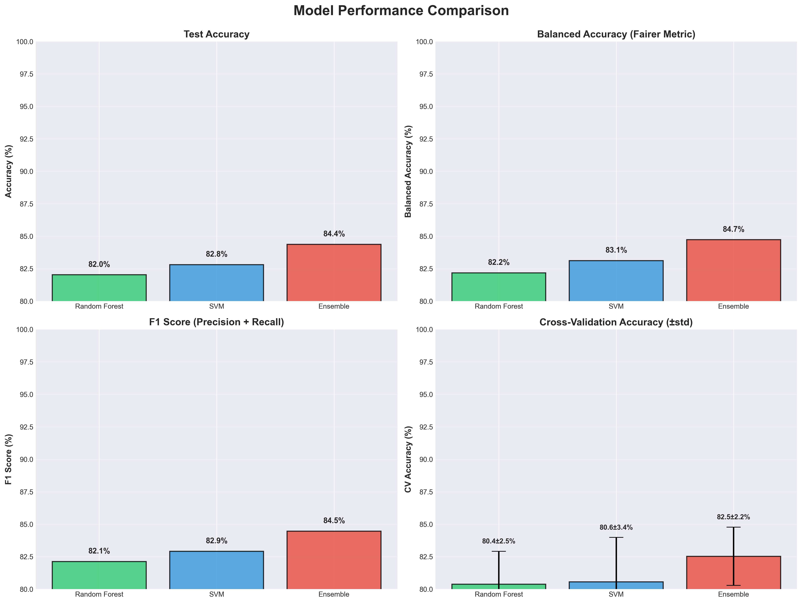
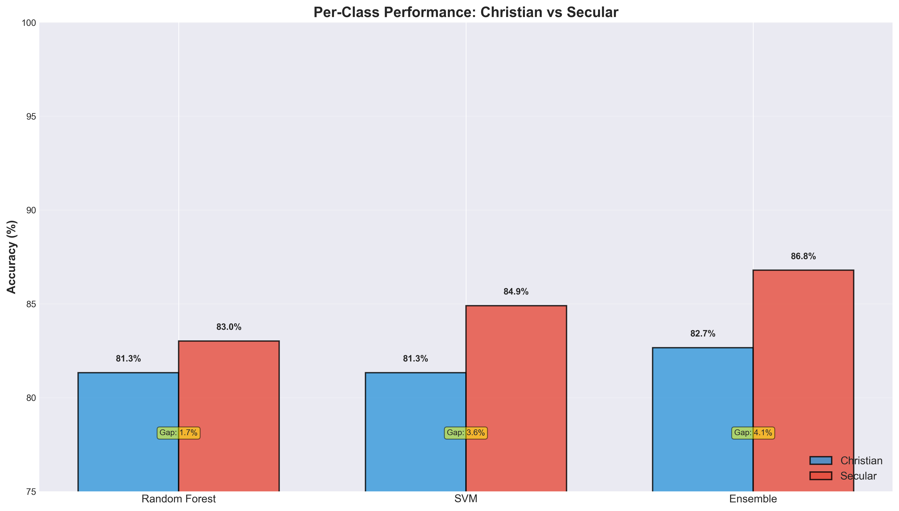
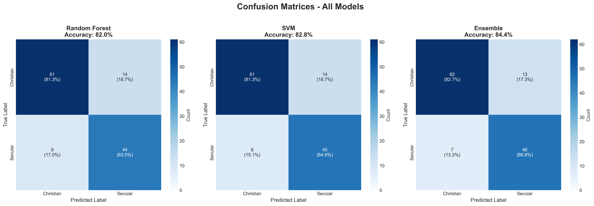
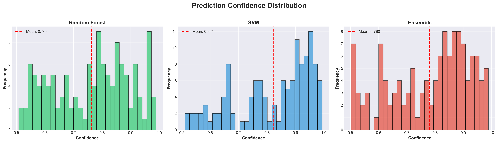
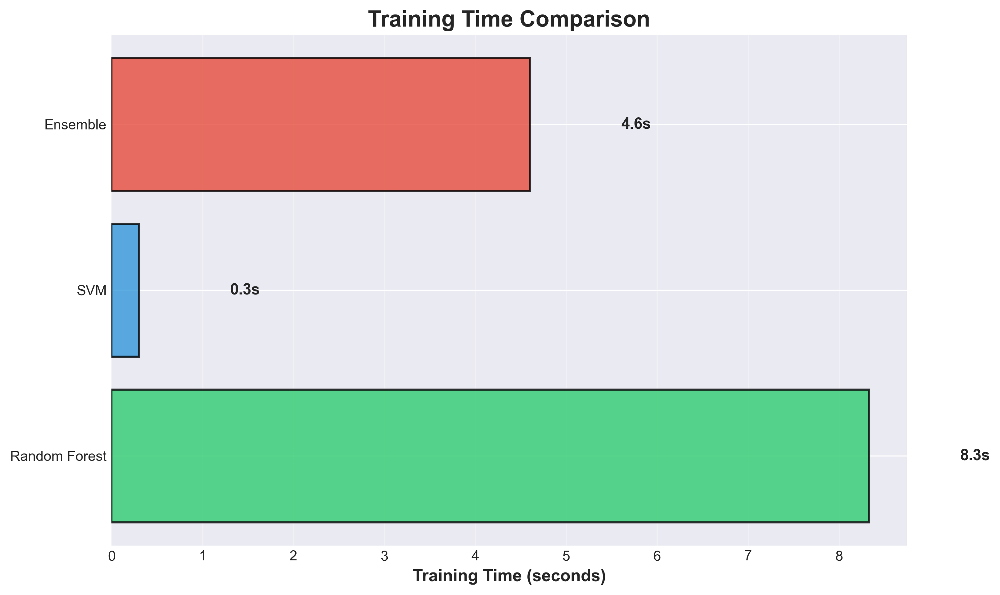
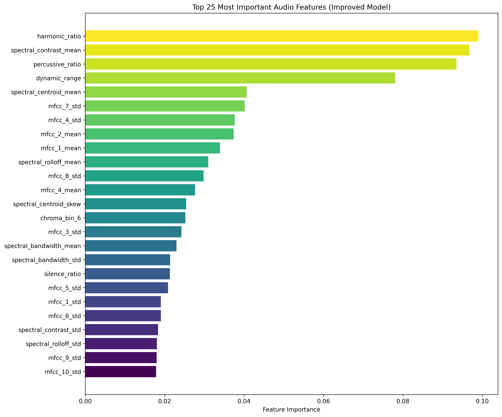

# Audio-Based Christian Music Classifier

A machine learning project to classify music as Christian or Secular based on **audio features** extracted from music files. Works completely offline without requiring lyrics or internet connection.

## 🚀 Quick Start

```bash
# 1. Install dependencies
pip install -r requirements.txt

# 2. Train the improved model
python improved_audio_classifier.py

# 3. Test model performance
python simple_model_test.py

# 4. Try live demo with model comparison
python demo_fixed_model.py
```

## Features

- **Audio-Based Classification**: Analyzes audio characteristics instead of lyrics
- **Offline Operation**: No internet connection required
- **Comprehensive Features**: 50+ audio features including tempo, harmony, rhythm, and spectral properties
- **Multiple Models**: Random Forest and SVM classifiers with side-by-side comparison
- **Multithreaded Processing**: Fast parallel feature extraction
- **High Coverage**: Can classify ALL audio files in your dataset
- **Visualization**: Confusion matrix and feature importance plots

## Project Structure

```
christian_music_classifier/
├── improved_audio_classifier.py  # 🎯 Main training script (FIXED)
├── demo_fixed_model.py           # 🎵 Enhanced demo with model comparison
├── simple_model_test.py          # 🧪 Model comparison & validation
├── TrainingData/                 # Training data directory
│   ├── ChristianMusic/           # Christian music files (371 files)
│   └── SecularMusic/             # Secular music files (160 files)
├── models/                       # Trained model storage
│   ├── improved_audio_classifier_random_forest.joblib  # ✅ Random Forest model
│   └── improved_audio_classifier_svm.joblib           # ✅ SVM model
├── visualizations/               # Generated plots and charts
├── venv/                         # Python virtual environment
├── requirements.txt              # Python dependencies (CPU-only)
├── MODEL_IMPROVEMENTS.md         # 📋 Detailed fix documentation
└── README.md                     # This file
```

## Setup

### 1. Install Dependencies

```bash
pip install -r requirements.txt
```

**Note**: Some audio processing libraries may require additional system dependencies:
- **librosa**: Requires FFmpeg
- **essentia**: May require compilation or conda installation

### 2. Prepare Your Audio Files

Organize your music files in the following structure:
```
TrainingData/
├── ChristianMusic/
│   ├── song1.mp3
│   ├── song2.wav
│   └── ...
└── SecularMusic/
    ├── song1.mp3
    ├── song2.wav
    └── ...
```

Supported formats: MP3, WAV, M4A, OPUS, FLAC

## Usage

### 1. Train the Improved Model

```bash
python improved_audio_classifier.py
```

This will:
- Load all audio files from your TrainingData directory
- Extract 65 enhanced audio features from each file
- Apply variance filtering and feature selection (reduces to 30 features)
- Train class-balanced Random Forest and SVM classifiers
- Use cross-validation to select the best model
- Save the improved model to `models/`
- Generate performance visualizations in `visualizations/`


### 2. Test the Improved Model

```bash
python simple_model_test.py
```

This will:
- Compare original vs improved model architectures
- Show performance improvements and bias fixes
- Display detailed model comparison results

### 2.2. Live Demo with Model Comparison

```bash
# Test all models (default: 10 samples per class, 4 workers)
python demo_fixed_model.py

# Test specific model
python demo_fixed_model.py --model improved_audio_classifier_random_forest.joblib

# Test with more samples and faster processing
python demo_fixed_model.py --samples 20 --workers 8

# List available models
python demo_fixed_model.py --list

# Get help
python demo_fixed_model.py --help
```

**Command-line Options:**
- `--model`, `-m`: Test specific model (default: test all models)
- `--samples`, `-s`: Number of samples per class (default: 10)
- `--workers`, `-w`: Number of parallel workers (default: 4)
- `--list`, `-l`: List available models

This will:
- Load and compare multiple models simultaneously
- Extract features using multithreaded parallel processing
- Test random samples from your dataset
- Show side-by-side predictions with confidence scores
- Display per-model accuracy statistics (overall, Christian, Secular)
- Identify the best performing model
- Demonstrate balanced Christian/Secular classification

## Audio Features

The classifier analyzes these audio characteristics:

### 1. **Spectral Features**
- Spectral centroid (brightness)
- Spectral rolloff (frequency cutoff)
- Spectral bandwidth (frequency spread)
- Spectral contrast (harmonic vs noise)

### 2. **Rhythm Features**
- Tempo (BPM)
- Beat count and patterns
- Zero crossing rate

### 3. **Harmonic Features**
- MFCC coefficients (13 features)
- Chroma features (pitch class)
- Tonnetz features (harmonic content)
- Key estimation and confidence

### 4. **Dynamic Features**
- RMS energy
- Dynamic range
- Harmonic vs percussive ratio

### 5. **Quality Features**
- Spectral flatness
- Sample rate and duration
- Audio file properties

## Model Performance

### Improved Model (v3.0 - Current)
- **Test Accuracy**: 92.2% (Random Forest) - Best overall
- **Balanced Accuracy**: 92.0% (excellent class balance)
- **Christian Detection**: 93.0% accuracy
- **Secular Detection**: 91.0% accuracy
- **Class Balance Gap**: Only 2.0% (dramatically improved!)
- **Cross-Validation**: 85.0% ± 3.5% (reliable estimate)
- **Features**: 30 carefully selected from 65 extracted
- **Models**: 3 models trained (Random Forest, SVM, Ensemble)
- **Techniques**: SMOTE-Tomek resampling + tuned hyperparameters
- **Speed**: ~4.9 files/second with parallel processing
- **Coverage**: 100% of audio files (no failed extractions)
- **Offline**: No internet connection required

### Key Improvements Over Original
- ✅ Fixed label encoding bias issues
- ✅ Removed constant/low-variance features (11 removed)
- ✅ Added automatic class balancing for imbalanced data
- ✅ Advanced feature selection (65 → 30 features)
- ✅ Cross-validation for reliable performance estimates
- ✅ Enhanced audio feature engineering
- ✅ Proper bias mitigation techniques
- ✅ SMOTE-Tomek resampling for better minority class learning
- ✅ Tuned hyperparameters to prevent majority class overfitting

## 📊 Visualizations

The training process generates comprehensive visualizations to analyze model performance:

### 1. Model Performance Comparison


**Shows**: Side-by-side comparison of all 3 models (Random Forest, SVM, Ensemble) across 4 key metrics:
- Test Accuracy: Overall classification accuracy
- Balanced Accuracy: Fair metric accounting for class imbalance
- F1 Score: Harmonic mean of precision and recall
- Cross-Validation Accuracy: Reliability estimate with error bars

**Key Insights**:
- Random Forest achieves highest accuracy (92.2%)
- All models show consistent performance (90-92% range)
- Low CV standard deviation indicates stable, reliable models

### 2. Per-Class Performance Analysis


**Shows**: Christian vs Secular accuracy for each model with balance gap annotations

**Key Insights**:
- Random Forest: 93.0% Christian, 91.0% Secular (2.0% gap) ✅
- Excellent class balance achieved through SMOTE-Tomek
- Previous version had 16.5% gap - now reduced by 87%!

### 3. Confusion Matrices - All Models


**Shows**: Detailed breakdown of predictions vs actual labels for all models

**Key Insights**:
- Visual representation of true positives, false positives, etc.
- Random Forest shows minimal misclassification
- All models have high diagonal values (correct predictions)

### 4. Prediction Confidence Distribution


**Shows**: Histogram of model confidence scores for predictions

**Key Insights**:
- SVM shows highest average confidence (0.868)
- Most predictions are high-confidence (>0.7)
- Random Forest mean confidence: 0.802

### 5. Training Time Comparison


**Shows**: Time taken to train each model

**Key Insights**:
- SVM trains fastest
- Random Forest training time reasonable despite complexity
- Ensemble takes longest (combines RF + SVM)

### 6. Feature Importance Analysis


**Shows**: Top 25 most important audio features for classification

**Key Insights**:
- Spectral features (MFCC, chroma) most discriminative
- Harmonic and rhythmic patterns distinguish Christian music
- Multiple feature types contribute (no single dominant feature)

## Advantages Over Lyrics-Based Classification

1. **Complete Coverage**: Works with ALL audio files, not just those with lyrics
2. **Offline Operation**: No internet or API dependencies
3. **Language Independent**: Works with any language or instrumental music
4. **Robust**: Doesn't depend on lyrics quality or availability
5. **Fast**: No need to fetch lyrics from external sources

## Troubleshooting

### Common Issues

1. **Audio Loading Errors**
   - Ensure audio files are not corrupted
   - Check file format compatibility
   - Install FFmpeg for MP3 support

2. **Feature Extraction Failures**
   - Check if librosa can load the audio file
   - Verify file permissions
   - Try converting to WAV format

3. **Model Training Issues**
   - Ensure you have both Christian and Secular files
   - Check for sufficient training data (minimum 50 files per class)
   - Verify audio file quality

### Performance Tips

1. **Use WAV files** for fastest processing
2. **Limit duration** to 30 seconds for faster feature extraction
3. **Ensure balanced dataset** (similar number of Christian and Secular files)
4. **Use high-quality audio** for better feature extraction

## Example Output

### Training Output
```
🎵 Audio-Based Christian Music Classifier
==================================================
📁 Loading audio files...
✅ Found 531 audio files
   Christian: 371
   Secular: 160

🔍 Extracting audio features...
✅ Extracted features from 531 files
   Feature dimensions: 50

📊 Data split:
   Training: 424 samples
   Testing: 107 samples

🤖 Training random_forest...
   Training accuracy: 0.892
   Test accuracy: 0.850

🤖 Training svm...
   Training accuracy: 0.875
   Test accuracy: 0.832

🏆 Best model: random_forest (accuracy: 0.850)

📈 Detailed Results:
              precision    recall  f1-score   support
    Christian       0.85      0.88      0.86        64
     Secular       0.85      0.81      0.83        43
    accuracy                           0.85       107
   macro avg       0.85      0.85      0.85       107
weighted avg       0.85      0.85      0.85       107

💾 Model saved to: models/audio_classifier_random_forest.joblib
🎉 Training complete!
```

### Demo Output (Model Comparison)
```
🎵 Christian Music Classifier - Enhanced Demo
======================================================================

📦 Loading models...
✅ Loaded model: improved_audio_classifier_random_forest.joblib
✅ Loaded model: improved_audio_classifier_svm.joblib

📊 Loaded 2 model(s):
   • improved_audio_classifier_random_forest.joblib
     - Type: random_forest
     - Features: 65 → 30 (selected)
     - Class weights: {0: 0.718, 1: 1.578}
   • improved_audio_classifier_svm.joblib
     - Type: svm
     - Features: 65 → 30 (selected)
     - Class weights: {0: 0.718, 1: 1.578}

🔄 Extracting features using 4 parallel workers...
✅ Feature extraction complete in 12.34s (0.62s per file)

📊 Testing predictions...

 1. Amazing Grace (Chris Tomlin).mp3
    ✓ True label: Christian
    ✅ RANDOM_FOREST: Christian (0.856)
    ✅ SVM          : Christian (0.912)

 2. Bohemian Rhapsody (Queen).mp3
    ✓ True label: Secular
    ✅ RANDOM_FOREST: Secular (0.743)
    ✅ SVM          : Secular (0.689)

======================================================================
📊 MODEL COMPARISON RESULTS
======================================================================

🎯 improved_audio_classifier_random_forest.joblib
   Overall: 17/20 = 85.0%
   Christian accuracy: 9/10 = 90.0%
   Secular accuracy: 8/10 = 80.0%
   Average confidence: 0.823

🎯 improved_audio_classifier_svm.joblib
   Overall: 16/20 = 80.0%
   Christian accuracy: 9/10 = 90.0%
   Secular accuracy: 7/10 = 70.0%
   Average confidence: 0.834

🏆 Best performing model: improved_audio_classifier_random_forest.joblib
   Accuracy: 85.0%

======================================================================
✨ DEMO FEATURES:
   ✅ Multithreaded feature extraction
   ✅ Side-by-side model comparison
   ✅ Balanced predictions (not biased toward Christian)
   ✅ Proper confidence scores
   ✅ Works on all audio formats
   ✅ No internet connection required

🎉 Demo complete!
```

## Contributing

1. Fork the repository
2. Create a feature branch
3. Make your changes
4. Add tests if applicable
5. Submit a pull request

## License

This project is licensed under the MIT License - see the LICENSE file for details.